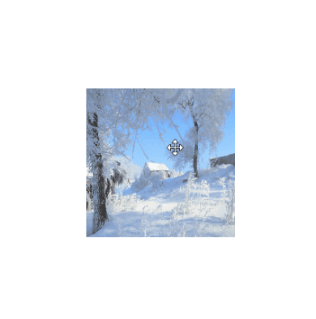
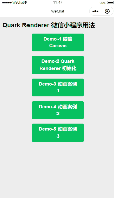

<p align="center">
    
</p>

<h1 align="center">QuarkRenderer</h1>

一款轻量且强大的 Canvas(&SVG) 渲染引擎，从 [ZRender](https://github.com/ecomfe/zrender) 改进而来。

## 背景

**重要：Quark Renderer 不是从零开始构建的，它是从 ZRender 魔改而来，ZRender 是 ECharts 底层的渲染引擎。**

我已经使用 ECharts 和 ZRender 很多年，在图形化领域，这两款工具都极其强大。

为了更好地理解 ZRender 底层的设计思想，最近我花了一些时间通读了它的源代码（2020-01）。在这个过程中，重构了大量的代码和注释，因为：

- 我想要一个定制化的版本，方便将来实现一些很酷的功能。
- 我想要一个更加干净的代码仓库，方便用来教我的学生们如何理解和设计一款 canvas 引擎，用于浏览器环境和微信小程序。
- 我想让引擎本身的代码变得更加易读一些。
- 之所以重新起了一个名字，主要原因有两个：首先，ZRender 默认会在全局空间里面导出一个全局变量 'zrender'，所以起一个新的名字可以避免潜在的命名冲突问题。其次，在 npm registry 里面不允许创建重名的项目。

与 ZRender 原始的实现相比，我的这个版本重点提升了这些特性：
- 用 ES6 语法重构了所有 class 和 .js 文件。
- 添加了键盘事件支持。
- 可以同时拖拽多个元素，按住 Ctrl 键复选。
- 为了让源代码更好理解，大幅度重构了 .js 文件和目录结构。
- 为了理解方便，重构了大量的实现细节。
- 修复了 /test 目录下一些案例中的 bug ，新增了一些测试案例。
- 用 [jsduck](https://github.com/senchalabs/jsduck) 来自动生成 API 文档，文档格式更加优美。
- 为了让 jsduck 能更好地生成文档，重构了所有代码注释。
- 直接支持微信小程序，不需要任何 hack。（还有一些问题需要解决）
- 直接支持 node-canvas，不需要任何 hack。（还有一些问题需要解决）
- 删掉了 VML 引擎，因为现在 IE 的市场份额已经很小了。
- 给仿射变换系统增加了 skew 特性。
- 给元素加上了变换控制手柄。
- 增加了连线功能，可以把元素连接起来，包括很酷的 Visio 形的连线。
- 重构了 Group 的实现，可以多层嵌套并控制子元素的位置。

## 用法

- 把本仓库 pull 到你本地。
- 在项目根目录运行 npm build 。
- 在你的浏览器中打开 /test 目录下提供的案例。

浏览器环境中的用法：

```html
<!DOCTYPE html>
<html>
<head>
    <meta charset="utf-8" />
    <title>Animation</title>
    <script src="../dist/quark-renderer.js"></script>
    <meta name="viewport" content="width=device-width, initial-scale=1" />
    <style>
        html, body, #main {
            width: 100%;
            height: 100%;
        }
    </style>
</head>
<body>
    <div id="main"></div>
    <script type="text/javascript">
        let main = document.getElementById('main');
        let qr = QuarkRenderer.init(main);
        
        let gradient = new QuarkRenderer.LinearGradient();
        gradient.addColorStop(0, 'red');
        gradient.addColorStop(1, 'black');

        let circle = new QuarkRenderer.Circle({
            position: [0, 0],
            scale: [1, 1],
            shape: {
                cx: 50,
                cy: 50,
                r: 50
            },
            style: {
                fill: gradient,
                lineWidth: 5,
                text:'circle',
                textPosition:'inside'
            }
        });
        qr.add(circle);
        
        // first animation process
        circle.animate()
            .when(1000, {
                position: [200, 0],
                scale: [2, 1]
            })
            .when(2000, {
                position: [200, 200],
                scale: [1, 1]
            })
            .when(3000, {
                position: [0, 200],
                scale: [1, 2]
            })
            .when(4000, {
                position: [0, 0],
                scale: [1, 1]
            })
            .during(function(){
                console.log(circle.animationProcessList.length);
            })
            .done(function(){
                console.log(circle.animationProcessList.length);
            })
            .start();//.start(true)

        //second animation process
        circle.animate()
            .when(1000, {
                position: [500, 0],
                scale: [2, 1]
            })
            .when(2000, {
                position: [200, 200],
                scale: [1, 1]
            })
            .when(3000, {
                position: [0, 200],
                scale: [1, 2]
            })
            .when(4000, {
                position: [0, 0],
                scale: [1, 1]
            })
            .during(function(){
                console.log(circle.animationProcessList.length);
            })
            .done(function(){
                console.log(circle.animationProcessList.length);
            })
            .start();//.start(true)
    </script>
</body>
</html>
```

微信小程序中的用法：

```html
<view class="page">
    <view class="page__hd">
        <view class="page__title">Quark Renderer 小程序示例1</view>
    </view>
    <view class="page__bd page__bd_spacing">
        <view style="width:100%;height:500px;">
            <canvas style="width: 300px; height: 500px;" canvas-id="firstCanvas"></canvas>
        </view>
    </view>
</view>
```

```javascript
onReady: function () {
    let ctx = wx.createCanvasContext('firstCanvas');
    //注意这里的初始化参数，因为微信小程序不允许操作 DOM，所以引擎不能自动获取到宽度高度，这里需要手动传进去
    let qr = QuarkRenderer.init(ctx,{width:300,height:500,renderer:'canvas'});
    let polygon = new QuarkRenderer.Polygon({
        position: [100, 100],
        scale: [1, 1],
        style: {
            fill: 'red'
        }
    });

    setInterval(function () {
        let len = Math.round(Math.random() * 100);
        let points = [];
        let r = (Math.random() * 100);
        for (let i = 0; i <= len; i++) {
            let phi = i / len * Math.PI * 2;
            let x = Math.cos(phi) * r + 100;
            let y = Math.sin(phi) * r + 100;
            points.push([x, y]);
        }
        polygon.animateTo({
            shape: {
                points: points
            }
        }, 500, 'cubicOut');
    }, 1000);
    qr.add(polygon);
}
```

## 文档

API 文档位于 /api 目录下，在你的浏览器中打开 /api/index.html 就可以看到很漂亮的 API 文档了，风格与 Sencha(ExtJS) 相同。


## 屏幕截图


<br/>

<br/>

<br/>

<br/>

<br/>

<br/>

<br/>

<br/>

VisioLink， 像 Microsoft Visio 中的那种连接线效果。
<br/>


微信小程序示例：



## 学习资源

[https://cloud.tencent.com/edu/learning/live-1902?ADTAG=xyj ](https://cloud.tencent.com/edu/learning/live-1902?ADTAG=xyj )


## License

BSD 3-Clause License

[LICENSE](./LICENSE)